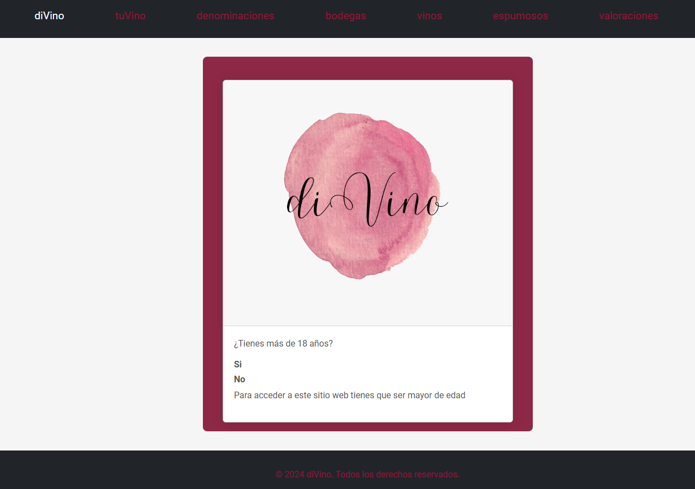

# Divino
Divino is my final project for the Advanced Course in Web Application Development.

### Description
The project will consist of a web application that will easily and quickly provide users with detailed information on a wide variety of Spanish wines with Designation of Origin (DO) and their respective wineries. 

The proposal includes the implementation of a personalised recommendation system, where users will be able to answer questions about their preferences and other relevant aspects. Based on these answers, the system will generate wine suggestions that match the individual tastes of each user.

In addition, users will be able to comment on and rate the wines available on the platform without having to register. 

To ensure data integrity and up-to-dateness, a CRUD system will be implemented on the server. This will allow the efficient management of the database of wines, wineries and appellations, allowing any necessary modification, whether it is adding new data, updating existing information or deleting obsolete data.

### [DivinoFront](https://github.com/anapi76/divinoFront.git)

In the frontend, a user-friendly web interface has been developed using Angular. This interface allows users to easily interact with the REST API provided by the Symfony backend. The application offers features for managing and visualizing data related to the application’s resources, ensuring an intuitive and responsive user experience. The frontend communicates with the backend through HTTP requests, enabling seamless CRUD operations and real-time updates.

### [DivinoBack](https://github.com/anapi76/divinoBack.git)

In the backend, a REST API has been created using the Symfony framework along with an ORM (Object Relational Mapping) to perform CRUD (Create, Read, Update, Delete) operations on a MariaDB database. The API provides endpoints that allow us to interact with the application’s resources.
